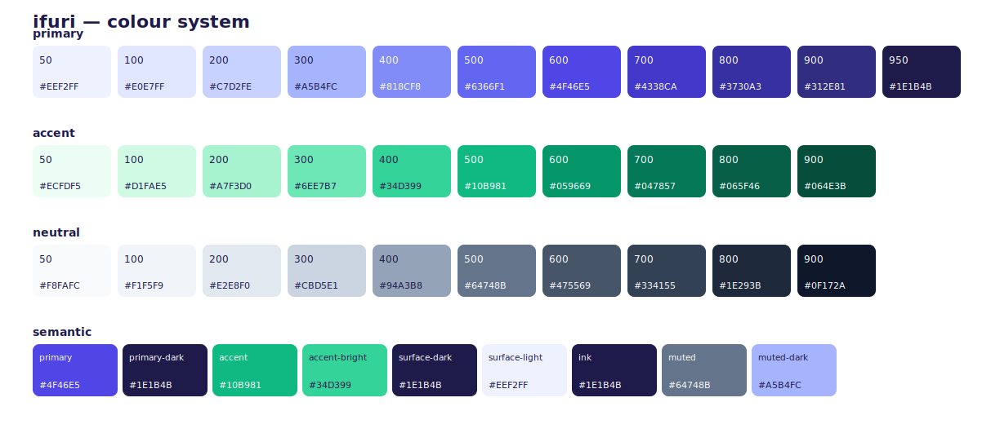

# ifuri — colour system

A standardized, token-based palette. Three ramps (**primary / accent / neutral**) plus
**semantic** tokens that name *how* colours are used. Always reference semantic tokens in product
code; reach into raw ramp steps only when you need a specific tint/shade.

## Semantic tokens (use these first)

| Token | Value | Role |
|-------|-------|------|
| `brand-primary` | `#4F46E5` | Core brand. `if` in the wordmark; mark on light surfaces |
| `brand-primary-dark` | `#1E1B4B` | Dark surface; `uri` on light; ink text |
| `brand-accent` | `#10B981` | Accent (2nd slash) on **light** |
| `brand-accent-bright` | `#34D399` | Accent (2nd slash) on **dark** |
| `surface-dark` | `#1E1B4B` | Dark background |
| `surface-light` | `#EEF2FF` | Light tile / wash |
| `text-ink` | `#1E1B4B` | Primary text on light |
| `text-muted` | `#64748B` | Motto / secondary text on light |
| `text-muted-dark` | `#A5B4FC` | Motto / secondary text on dark |

White `#FFFFFF` is the mark + `uri` colour on dark surfaces.

## Ramps

### primary — indigo
| Step | Hex | RGB |
|------|-----|-----|
| `primary-50` | `#EEF2FF` | 238, 242, 255 |
| `primary-100` | `#E0E7FF` | 224, 231, 255 |
| `primary-200` | `#C7D2FE` | 199, 210, 254 |
| `primary-300` | `#A5B4FC` | 165, 180, 252 |
| `primary-400` | `#818CF8` | 129, 140, 248 |
| `primary-500` | `#6366F1` | 99, 102, 241 |
| `primary-600` | `#4F46E5` | 79, 70, 229 |
| `primary-700` | `#4338CA` | 67, 56, 202 |
| `primary-800` | `#3730A3` | 55, 48, 163 |
| `primary-900` | `#312E81` | 49, 46, 129 |
| `primary-950` | `#1E1B4B` | 30, 27, 75 |

### accent — emerald
| Step | Hex | RGB |
|------|-----|-----|
| `accent-50` | `#ECFDF5` | 236, 253, 245 |
| `accent-100` | `#D1FAE5` | 209, 250, 229 |
| `accent-200` | `#A7F3D0` | 167, 243, 208 |
| `accent-300` | `#6EE7B7` | 110, 231, 183 |
| `accent-400` | `#34D399` | 52, 211, 153 |
| `accent-500` | `#10B981` | 16, 185, 129 |
| `accent-600` | `#059669` | 5, 150, 105 |
| `accent-700` | `#047857` | 4, 120, 87 |
| `accent-800` | `#065F46` | 6, 95, 70 |
| `accent-900` | `#064E3B` | 6, 78, 59 |

### neutral — slate
| Step | Hex | RGB |
|------|-----|-----|
| `neutral-50` | `#F8FAFC` | 248, 250, 252 |
| `neutral-100` | `#F1F5F9` | 241, 245, 249 |
| `neutral-200` | `#E2E8F0` | 226, 232, 240 |
| `neutral-300` | `#CBD5E1` | 203, 213, 225 |
| `neutral-400` | `#94A3B8` | 148, 163, 184 |
| `neutral-500` | `#64748B` | 100, 116, 139 |
| `neutral-600` | `#475569` | 71, 85, 105 |
| `neutral-700` | `#334155` | 51, 65, 85 |
| `neutral-800` | `#1E293B` | 30, 41, 59 |
| `neutral-900` | `#0F172A` | 15, 23, 42 |

## Mark colour rules

| Surface | Branch + 1st slash | 2nd slash (accent) | Tile |
|---------|--------------------|--------------------|------|
| Indigo / dark | `#FFFFFF` (white) | `brand-accent-bright` `#34D399` | `brand-primary` / `surface-dark` |
| Light | `brand-primary` `#4F46E5` | `brand-accent` `#10B981` | `surface-light` or transparent |
| Mono | single colour (`text-ink` or `currentColor`) | same | none |

The two leftmost strokes (the perpendicular branch and the first slash) always share one colour;
the second, parallel slash carries the accent.

## Contrast (WCAG)

| Pair | Ratio | Use |
|------|-------|-----|
| White on `brand-primary` `#4F46E5` | ~4.9:1 | mark/text on indigo — AA |
| White on `surface-dark` `#1E1B4B` | ~16:1 | text on dark — AAA |
| `text-ink` on white | ~16:1 | body text — AAA |
| `text-muted` on white | ~4.7:1 | motto — AA |

## Token files
- `color/tokens.json` — full ramps + semantic + RGB source of truth
- `color/tokens.css` — `--ifuri-*` CSS custom properties
- `color/tokens.scss` — `$ifuri-*` SCSS variables
- `color/tailwind.colors.js` — drop into `theme.extend.colors.ifuri`
- `color/palette.svg` / `palette.png` — visual swatch sheet
